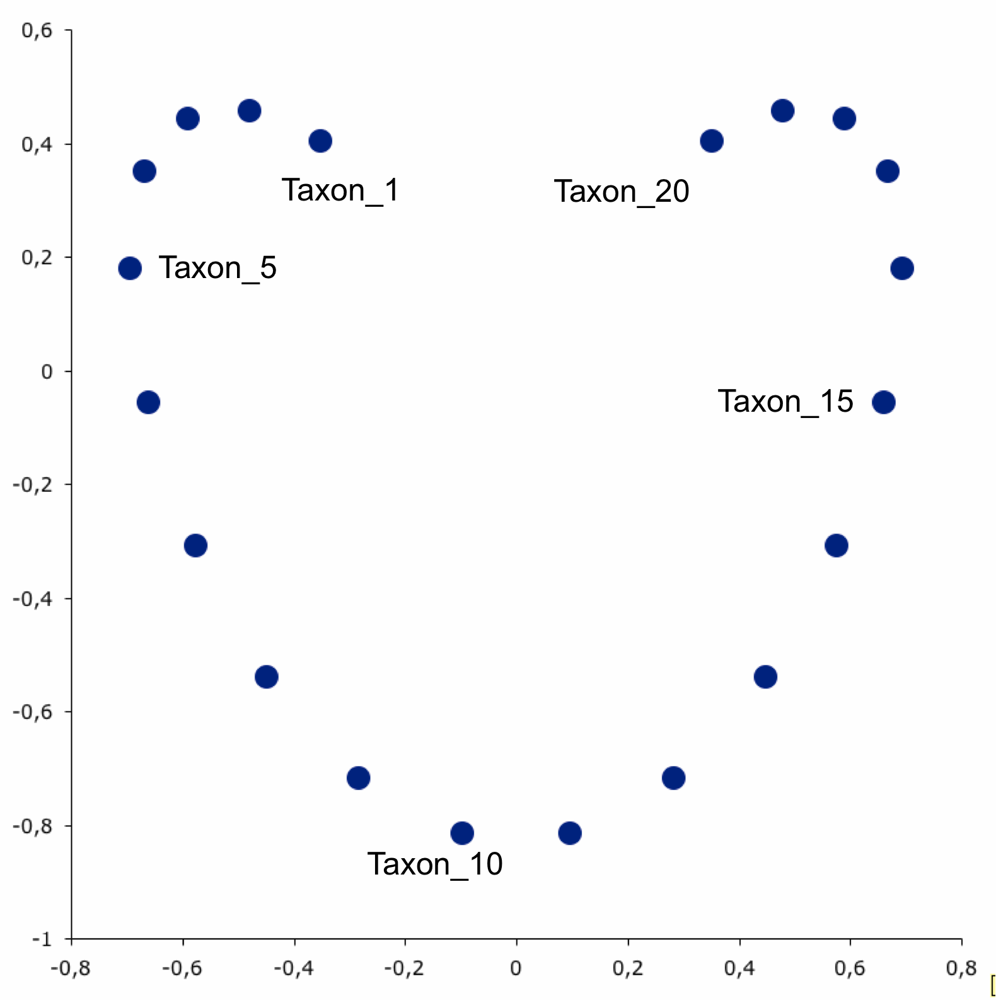

# Welcome to the VMI Microbiome Workshop!


Introducing the Microbiome
-------------------------------------------------------------------------------------------------

A **biome** is a complex ecosystem of biological organisms, often defined and shaped by a shared ecosystem.

Therefore, a **microbiome** is a complex ecosystem of microorganisms:

* Bacteria
* Eukaryotic Fungi and Protists
* Archaea
* Viruses and Phages


   Scanning electron image of a complex microbial community. *Colors are artificial.* Source: https://www.newscientist.com

**There are very few places on earth where microbiomes do not exist**

   - Deep sea vents
   - A mile underground
   - High Atmosphere
   - Middle of the ocean
   - *On* and *inside* pretty much every animal and plant (*outside of the lab*)

Since animals and eventually humans arose they have been ubiquitously interacting with and evolving alongside microbial communities

Definitions
-------------------------------------------------------------------------------------------------

In popular science and among the public the term microbiome is thrown around as a **community of microorganisms**.

Within the research community however there is more nuance (but microbiome is still used loosely), so let's clearly define some important terms:

* **Microbiota** - The microorganisms forming a complex community, often characterized using taxonomy.
  * The bacterial component is what we will examine with **16S Amplicon Sequencing**.
  * *Who is there?*


* **Microbiome** - The total genomic composition of all organisms in a *microbiota*.
  * Examined with **Metagenomic Shotgun Sequencing**. Not restricted to bacteria.
  * *What could they do?*


* **Metagenome** - The *microbiome* as captured with high-throughput genetic sequencing.
  * Captures random sections of DNA from all *microorganisms* and *macroorganisms*.
  * *What functions are available to the community?*


* **Metatranscriptome** - The expressed RNA components of a *microbiome* captured with high-throughput genetic sequencing.
  * RNA is extracted, reverse transcribed, and sequenced.
  * *What are they trying to do?*


* **Proteome** - The protein profile resulting from transcription and translation of the *microbiome*.
  * Often examined with mass spectrometry or sometimes NMR.
  * *What are the actively able to do?*


* **Metabolome** - The profile of metabolites and biologically active chemicals.
  * The *metabolome* is shaped by enzymatic activity of the *proteome*.
  * Most often examined with targeted or untargeted mass spectrometry.
  * *How are their actions shape the abiotic and biotic environment?*


   Like a nesting doll family, there are many layers that can each tell their own part of the story. Source: Giphy.communities


The Human Microbiome
-------------------------------------------------------------------------------------------------


   What are the biomes of microbes on and inside the human body? Source: http://microbeminded.com/


**It is estimated that there are roughly the same number of human and microbial cells in your body!**

* This encompasses trillions of living microorganisms.
* Surveys often report hundreds to thousands of unique bacterial species.
* Microbiome diversity of 10 million+ unique genes, outnumbering our genetic repertoire 500:1.
* Vast majority are along digestive tract, but skin and vagina have unique communities as well.


   Estimating counts and mass of cells in the human body. Source: Sender, R. et al. *PLoS Biology*. 2016.


**While highly abundant, microbes are much smaller than human cells.**


   Most microbes are 10-100x smaller than human cells (*same size as mitochondria*). Source: https://courses.candelalearning.com

16S Ribosomal DNA and Phylogenetic Markers
------------------------------------------

**So how can we look at which microbes make up a microbiota?**

The methodology we are discussing today falls under the umbrella of **Amplicon Sequencing**.

In *amplicon sequencing*, one gene shared by all microorganisms of interest is amplified and sequenced to characterize *who is in the microbiota*?

**Amplicon sequencing involves:**
   1. Extracting all DNA from a microbial community.
   2. PCR amplifying a specific marker gene shared by the microbes of interest.
   3. Sequencing all of the PCR amplicons.
   4. Assigning the genetic sequences back to reference databases of known microbes.
   5. Compiling counts of the number of sequences representing each taxon.

This is most often done for *bacterial communities* with sections of the DNA coding region of **16S Ribosomal RNA**.


   Secondary hairpin structure of 16S rRNA. Source: rna.ucsc.edu

**16S rRNA Structure**

* The RNA component of bacteria ribosomes forms bonds between nucleotide bases.
* The attraction of these bases forms secondary loop and hairpin structures.
* Tertiary structure forms and combines with protein components of the ribosome to form an active unit.

<p align="center">
  
</p>

   30S ribosome small subunit with *16S rRNA in orange* and a number of *purple proteins*. Source: wikipedia.com

**This is a useful gene because:**

* It is shared by almost all bacteria and archaea.
* The ribosome is crucial to life
  * RNA sequence is critical for tertiary structure backbone
  * Leads to stabilizing selection
* For this reason it is slow evolving, particularly in regions important to the overall structure.
* Thus it has regions that are more conserved and regions that are more variable (*evolutionary changes accrue more quickly*).


   Nine variable regions are each separated by highly conserved regions. Source: biology.stackexchange.com

**16S rDNA is not the only marker gene used for amplicon sequencing, just the most common.**

* Fungal communities are often targeted with the ITS (Internally Transcribed Spacer).
  * Region between the 18S and 5.8S rRNA genes in Eukaryotes.


* Archaea are generally targeted with different 16S primers.
  * They do not have enough homology with bacteria (captured with bacterial amplicons, but very biased).
  * Bacteria usually vastly outnumber archaea, dominating sequencing power.


* I've heard of 18S and 28S being used for protists and fungi, but could really use many genes. Except...

**Keep in mind before you try to design your own amplicons...**

* Many genes are not under such strict conserving selection.
  * Homology and even presence may be far more taxon restricted.
  * Harder to target because of lack of conserved regions.


* PCR amplicons to a new gene or region require extensive validation.
  * May not amplify different orthologs equally, thus biasing abundance.
  * Could use mock community with known abundance as a control.

**Therefore, don't try to design your own primers unless you have a really good reason... and lots of time to validate.**

* The main application would be interest in a smaller subset of taxa (i.e. betaproteobacteria class).
  * Could provide better strain resolution, but I wouldn't trust abundance.
  * Allows more reads from organisms of interest, but miss everything else.

Advantages and Disadvantages
----------------------------

**Key advantages of Amplicon Sequencing**

* There are very well studied protocols, amplicons, and tools.
  * The [Earth Microbiome Project](http://www.earthmicrobiome.org/protocols-and-standards/) protocol is the most widely accepted.
    * Very well validated, and used in many studies including the [Human Microbiome Project](https://hmpdacc.org/).
    * Have protocols for 16S, 18S, and ITS detailing steps and best practices.


* There are great comprehensive tools to analyze the data.
    * We will use [QIIME2](https://qiime2.org/), but [Mothur](https://www.mothur.org/) is also widely used.


* Generally the cheapest and most approachable method (compared to metagenomic sequencing as an alternative).
  * Requires less sequencing depth per sample to get confident profile.
  * This allows far more samples to be on a sequencing run.
  * In 16S we usually want 10-100k assigned sequences per sample.
  * In metagenomics 1-2 million sequences is the extreme low end, often want 10X that.


* Much more computationally approachable.
  * Search against database of one gene vs all full genomes (including eukaryotic, host, viral...).


* Less likely to sequence any relevant amount of human DNA.
  * Could make IRB approval easier.
  * Don't need to remove human DNA before publicly sharing, or having to restrict access to approved parties i.e. dbGAP.
  * However, if there is very little microbial, DNA I have seen mostly off target sequences from human mitochondria.

**Key disadvantages of Amplicon Sequencing**       

* Amplicons can only tell you who is there and in what abundance.
  * It cannot tell anything about the functional capabilities of the microbes.


* It is semi-quantitative at best, not absolute.
  * Can really only examine relative abundance.
    * Thus never know if one sample has more or less microbes, only a microbe's ratio with other microbes.
    * No idea if changes over time are because the total number of microbes increased, decreased, or just shifted members.


* Resolution is limited because the amplicons are short, so generally family or genera is the most that can be distinguished.
  * Really cannot confidently distinguish species or strains within a genus.
  * Newer primers for longer amplification regions (e.g., 16S V4-V5) allow for species-level resolution, but still not strain-level resolution

         

Aligning short reads means there may be very few differences to distinguish related taxa. Source: nature.com


* 16S rRNA gene copy number can vary by an order of magnitude between bacterial species.
  * The databases try to correct for this, but it's not perfect.
  * This means there is some bias in the relative abundance of members.
  * 16S rt-qPCR can be used to quantify the total number of 16S rRNA genes in your sample or the number of 16S rRNA genes for a specific taxonomic group of bacteria.


   Most bacteria have two or more copies of rDNA in their genomes, which must be corrected for when counting totals. Source: researchgate.net

   _Seeing DNA in a sample does not confirm that there are live microbes, just that their DNA was present._


Experimental Design and Sample Preparation
============================================

**Key Takeaways**

**There are caveats and biases in every method**
   - Understand the biases in your methods
   - Understand how that bias will affect results

**Plan and optimize well, then stick to one protocol!**

Experimental Design
------------------------------------------------------------------

**How do I start a microbiome amplicon study? Plan ahead!**

It is particularly important to consider the details of your study before you start

* Cannot add samples later
* Cannot remove contamination after samples are collected
* Cannot add controls necessary to validate quality after sequencing
* Cannot remove bias if other factors vary with treatment of interest
* Cannot get more microbial DNA if host DNA dominates


   Source: Aaron Bacall Source: www.art.com


**Start with a question and hypothesis.**
* Consider expected effect size on microbiome composition
* Calculate how many samples will be needed to detect if the effect exists
* Consider changes community wide and detecting changes in taxon abundance and presence
* Keep in mind not every sample will pass every QC step - samples will be lost
  * Larger N
  * Parallel processing replicates

**Always step back and ask: "Will a whole community profile answer my question?"**
* Often people hypothesize that "the microbiome will change", without considering what that actually means
  * Amplicon sequencing doesn't tell you community function
  * It won't give you strain or even consistent species level resolution
    * In addition to *E. coli*, there are five other species in the genus *Escherichia* and some are commensal in the human gut

Sampling and Controls
------------------------------------------------------------------

**How will you collect your samples?**

**Generally consider in collection:**

* **Size of sample**
  * Determines available DNA
  * Can you control an equal amount from each subject - *absolute quantification*
  * Reserve sample - mix evenly so reserve is the same as utilized sample


* **Sampling vessel**
  * Ease of collection
  * Sterility
  * Stabilization solution
    * Need DNA *and* RNA
    * Other 'omics - *i.e. mass spectrometry affected by salt concentration, SCFA metabolites interact with ethanol*


   Source: www.dnagenotek.com

* **Storage**
  * Immediate storage -80C > Storage at -20C > Storage at room temperature in >90% ethanol
  * Long term stabilization solutions can introduce bias
  * Prevent bacterial overgrowth at room temperature

**Key controls to keep in mind:**

* **Uniformity**
  * Collect samples at the same time and method across treatment groups
  * Same for processing DNA extraction and library preparation for sequencing


* **Randomization**
  * Consider many factors that could vary across treatment groups
    * Time of day, season
    * Sampling in same location
  * Mouse cage effects
    * Co-housing
    * Mixing bedding and food
  * Other factors that can influence microbiomes
    * Age, sex, reproductive status, health status, body fat percentage, recent antibiotic use, etc


* **Sterility**
  * Collect samples, but also sample microbes in the local environment if possible
  * Always include blank water samples
    * Collection blanks
    * Extraction blanks
    * Library preparation blanks
    * Sequencing blanks
  * Work in biosafety hood whenever possible
    * Particularly sensitive to contamination before PCR steps


* **Mock community**
  * Known taxonomy and abundance


* **Generous donor**
  * If sampling / extracting / sequencing in batches include one consistent sample across each

**If working with human subjects:**

<p align="center">
  
</p>
   Source: Charis Tsevis

   - Consider ease of self-collection
   - Different body sites have very different communities
      - Even location on a stool sample (inside versus outside)
   - Biopsies are loaded with human DNA
   - IRB compliant methods
      - Gloves
      - Way to catch stool in toilet and disposal
      - Proper instructions
   - Immediate acquisition versus returning samples later
      - Cannot control amount provided if self-collection
	  - Must stablize to prevent bacterial overgrowth, or 'blooms'


   Source: www.dnagenotek.com

DNA Extraction
------------------------------------------------------------------

**DNA extraction techniques vary significantly in community bias**

   - Every kit introduces bias, so pick one and stick with it!
      - There are many options, so research which is best for your long term goals
      - The [Earth Microbiome Project](http://www.earthmicrobiome.org/protocols-and-standards/dna-extraction-protocol/) has well documented protocols.


   - Efficiency at lysing cells is important
      - Bead beating versus chemical lysis
      - Mechanical bead beating seems to be most thorough gram +/-
      - Keep in mind bead beating heats the sample through friction, don't over-do it!
      - Heat can be your friend for difficult-to-extract samples, however


   - Take time to properly optimize and document
      - Always note extraction batch, who performed the extraction, and the kit lot number
      - Always include extraction blanks, all kits have contaminants - [kit'ome](https://bmcbiol.biomedcentral.com/articles/10.1186/s12915-014-0087-z).
      - Some kits perform dual DNA and RNA extraction

Amplification
------------------------------------------------------------------

**PCR amplification of the marker gene of interest**

   - **Use known protocols and established primers**
      - Different variable regions bias the community differently, stick to what's known!
      - The [Earth Microbiome Project](http://www.earthmicrobiome.org/protocols-and-standards/16s/) has well documented PCR protocols (*16S, 18S, ITS*)
      - Always optimize your PCR for the expected sequence length and concentration
      - Include PCR blank to control for processing contamination


   - **Sequencing Depth**
     - Generally 10k - 100k sequences per sample is adequate coverage
     - Diminishing returns at greater depths
        - Taxonomic resolution based on sequence length not sequencing depth
       - Many reads increase sequencing errors, qc filtered
       - Analyses are rarefied or relative abundance
          - Rare organisms will still be rare, depth doesn't change proportions

Earth Microbiome Project V4 Primers

515F FWD: GTGYCAGCMGCCGCGGTAA

806R REV: GGACTACNVGGGTWTCTAAT

Earth Microbiome Project V4-V5 Primers

515F FWD: GTGYCAGCMGCCGCGGTAA

926R REV: CCGYCAATTYMTTTRAGTTT

*The primer sequences in EMP protocols are always listed in the 5′ -> 3′ orientation.  This is the orientation that should be used for ordering.*

Components of full reaction:

\_\_\_\_\_5′ Illumina adapter_________________________Golay barcode_____Pad________Linker___Forward primer

FWD:  AATGATACGGCGACCACCGAGATCTACACGCT XXXXXXXXXXXX  TATGGTAATT GT      GTGYCAGCMGCCGCGGTAA

   - Each sample PCR reaction will be performed with it's own unique barcode combination
   - This allows bioinformatic demultiplexing - assigning sequences to their respective sample

Sequencing Platforms
------------------------------------------------------------------


   Illumina sequencing molecular biology Source: Jaroslaw Grzadziel (Research Gate)

**Illumina MiSeq**

   - By far the most widely used sequencing method for 16S rRNA gene amplicon sequencing
      - \>5,000,000 sequences per run allow multiplexing many samples
      - High coverage of the community (~10k sequences per sample is ideal depending on complexity)


   - Short sequences up to 300bp generally cover 1-3 variable regions
      - Allows high coverage, but lose resolution past genus level
      - Paired end is better than single end, as long as your forward and reverse reads overlap

**Illumina HiSeq/NextSeq/NovaSeq**
   - Widely used sequencing method for shotgun metagenomic sequencing
   - 50-150 bp sequence reads (Not long enough for most amplicon sequencing)


**PacBio and Nanopore**
   - Can do full 16S gene
      - Very high strain level resolution
      - But *much* lower coverage and multiplexing = higher costs
      - Higher error rates


Metadata File
------------------------------------------------------------------

**How do you store all of this information about samples in a useful way?**

   - **A metadata file is composed of:**
      - Each row representing a sample
      - Each column representing some information about each sample
      - Are TSV - tab separated values
         - TSV is a .txt output format from Excel
      - A header line starting with a # indicates the column names

- There is a bit more flexibility in file structure in QIIME2, but any mapping file that worked in QIIME1 is a valid metadata file in QIIME2


   Source: Example mapping file in excel.

* Always start with **#sampleid** column
  * A unique id for each sample - cannot be the same as any other sample


* Include columns for the unique sample **barcodes**
  * Allows demultiplexing of sequences to their respective sample


* Also include **control and qc** information about DNA extraction batch, person extracting, PCR batch, sequencing run, cage...
  * Allows testing if these factors influenced the community composition
  * Have columns indicating which samples are blanks, mock community, and generous donor samples


* Have columns for your **treatment** and any **covariates** of interest
  * Age, sex, BMI, collection season...


* Last column should be **description** if you need backward compatibility with QIIME1

For more detailed information check out the full [QIIME2 Metadata Guide!](https://docs.qiime2.org/2021.4/tutorials/metadata/)

**Best Practices**

   - Rule Number 1: Don't get fancy!
      - Don't use spaces, use _ (underscore) instead
      - Except #sampleid, the only punctuation in this column can be dashes '-' (no underscores)
      - Don't include other types of punctuation, this will only cause problems later on!

   - Leading and trailing white spaces are ignored

   - I'd stick to all lower-case (case insensitive) characters
      - Not required, but may save you a *lot* of trouble with weird errors later on!

Sampling the Mouse Microbiome
==================================================================
<p align="center">
  
</p>

The objective of this lecture is to provide the attendees with an overview of factors that may influence animal experiment outcomes in microbiota research. Additionally, we will discuss the experimental approaches available to establish a causative role for the gut microbiota in disease. 

Please find the presentation being shared by Dr. Byndloss available for download [here](https://github.com/vmimicrobiome/vmimicrobiome.github.io/blob/main/images/Presentation_Bootcamp%202021.pdf) and an excellent article on *best practices for analysing microbiomes* [right here!](https://pubmed.ncbi.nlm.nih.gov/29795328/)


From Sequences to Community Composition
=================================================================

Data Source: https://github.com/vmimicrobiome/vmimicrobiome.github.io

**What to do when you get back your sequence files?**

Sequence File Formats
------------------------------------------------------------------

**What do sequence file formats look like?**

They can be displayed in a couple ways.

**The first is as two separate files for the sequences and the quality scores**


   Fasta and quality score file formats

   - Fasta files - The genetic sequences of your amplicons

      - Header lines always starts with a '>'
         - Describes the sequence, often an id or incremental number
      - Next line is the genetic sequence of your amplicon itself (A,T,C,G's)

   - Quality score files
      - Start with the same headers as the fasta file
      - Contain scores that describe how confident the sequencer is in that particular base call
      - Often these are expressed as Phred scores:


   Phred score translation to base call accuracy

**A second way you may find your files is a fastq file**


   Fastq file format

   - Fastq is essentially a combination of fasta and quality score files
      - Header lines often start with '@'
      - Followed by the genetic sequence like a fasta file
      - The third line is generally just a '+'
      - The fourth line is a condensed form of the quality scores
      - Then the pattern repeats for the next sequence

**Some sequencing centers perform some quality processing, others don't. Make sure you ask what has been done!**

   - If they try to provide another format or raw data, ask for one of these two options. This is standard.
   - Always get quality scores, even if they "did quality control for you"


Types of Sequences in QIIME2
------------------------------------------------------------------

**How do you make QIIME2 aware of your sequences and mapping file?**


   Source: Martha Park - Institute for Quantitative & Computational Biosciences Workshop

   - **QIIME2 must import all data files and convert them**
      - They become custom QIIME2 format files
      - Allows for compression to save space and allow faster access

   - **Importing sequences has lots of options**
      - Some sequencing centers may demultiplex into fastq file for each sample
      - Single versus paired end sequencing
      - Quality scores or not (if you generated the data you should have these)
      - Barcodes may be in a separate file


   Source: QIIME2 - https://docs.qiime2.org/2021.4/tutorials/overview/#demultiplexing

**Generally importing sequences will follow this format:**

```bash
   qiime tools import \
      --type XXX \ # The format of your sequence files
      --input-path XXX \ # The folder or manifest file where sequences are located
      --input-format XXX \ # Tell QIIME2 how to import the sequences properly
      --output-path XXX # Where the processed sequences should be saved
```  

**Fastq Manifest Format**

This is the most flexible approach if the sequencing center demultiplexed your samples

**Make a manifest telling QIIME2:**
   - Which files align to which samples
   - The paths to each of those files
   - The direction: forward or reverse

**Manifest Format**
   - CSV - comma separated values in each column
   - sample-id must match the sample names in your mapping file
   - Header line must match below
   - Save as CSV file

sample-id,absolute-filepath,direction #header line

sample-1,$PWD/some/filepath/sample1_R1.fastq,forward

sample-1,$PWD/some/filepath/sample1_R2.fastq,reverse

**Phred 33 vs 64**
   - Phred scores are sometimes offset by 31, depends on sequencer software
   - This is important because they are always converted to 33 - Ask sequencing center!
   - If you can ask for 33, as the 64 can be slow to convert for large files


   Phred score encoding for 64 and 33. Source: https://www.drive5.com/usearch/manual/quality_score.html

**Command options:**
```
   -input-format
      - SingleEndFastqManifestPhred33
      - SingleEndFastqManifestPhred64
      - PairedEndFastqManifestPhred33
      - PairedEndFastqManifestPhred64

   -type
      - 'SampleData[SequencesWithQuality]'
      - 'SampleData[PairedEndSequencesWithQuality]'

   -input-path
      - Path to your manifest file or folder of files

   -output-path
      - Where QIIME2 will save the processed sequences in .qza format
  ```   
Depending on your formats it will look something like:


**Example for Paired end with Phred 64**

 ```bash
   qiime tools import \
     --type 'SampleData[PairedEndSequencesWithQuality]' \ # Change for paired/single end sequences
     --input-path my_manifest.txt \
     --output-path 1_0_input_seqs.qza \
     --input-format PairedEndFastqManifestPhred64 # Change for paired/single and phred format
```
**Earth Microbiome Project format**

This is a more specific format if you follow the EMP protocols and the sequencing center does as well

A good approach if your sequences are not demultiplexed (all samples sequences together)

   - All files in fastq format - often .gz indicates GunZip compression
   - Single End:
      - Fastq file of sequences - sequences.fastq.gz
      - Fastq file of separated barcodes (by sequencing center) - barcodes.fastq.gz
   - Paired End:
      - Fastq file of forward sequences - forward.fastq.gz
      - Fastq file of reverse sequences - reverse.fastq.gz
      - Fastq file of separated barcodes (by sequencing center) - barcodes.fastq.gz

Place these files in a folder (my_seqs/), and use that folder name as the --input-path argument:


**Single End**
   ```bash
   qiime tools import \
     --type EMPSingleEndSequences \
     --input-path my_seqs \
     --output-path 1_0_input_seqs.qza
```
**Paired End**
   ```bash
   qiime tools import \
     --type EMPPairedEndSequences \
     --input-path my_seqs \
     --output-path 1_0_input_seqs.qza
```

**There are other options for inputting sequences** :
check the [QIIME2 documentation](https://docs.qiime2.org/2021.4/tutorials/importing/) if these don't fit your data


Now let's get to work and try it on some example data!!!
------------------------------------------------------------------

**Importing and Demultiplexing**

<p align="center">
  
</p>

First lets take a look at the mapping file to understand how QIIME2 creates visuals

```bash
   qiime metadata tabulate \
     --m-input-file paired_end/metadata.tsv \
     --o-visualization paired_end/1_0_metadata_stats
```

This will output a file 1_0_metadata_stats.qzv
   - .qzv files are QIIME2's visualization files
      - They can be opened with 'qiime tools view ...'
   - .qza files are QIIME2's data files
      - These cannot be viewed, and are often compressed
	  - Other scripts can often create visual .qzv files from .qza

**Let's see what we made**

```bash
   qiime tools view paired_end/1_0_metadata_stats.qzv
```

**To import sequences and demultiplex...**

1. You should navigate to the folder called data/
2. We will use the folder paired_end: This contains multiplexed sequence files and a metadata file
   1. Forward sequences - reverse.fastq.gz
   2. Reverse sequences - forward.fastq.gz
   3. Barcode sequences - barcodes.fastq.gz
   4. Metadata file - metadata.tsv
3. We will import the sequences into QIIME2 format
4. We will demultiplex the sequences
5. We will examine the distribution of sequences across each sample


**See the files**

```bash
   ls -lsh paired_end/raw_seqs/
   ```

   **Import the files into QIIME2 format**
   ```bash
   qiime tools import \
      --type EMPPairedEndSequences \
      --input-path paired_end/raw_seqs/ \
      --output-path paired_end/1_0_input_seqs.qza
 ```   
   **See the new output file**
   ```bash
   ls -lsh paired_end
   ```
   **Demultiplex the sequences based on barcodes in mapping file**
```bash
   qiime demux emp-paired \
      --m-barcodes-file paired_end/metadata.tsv \
      --m-barcodes-column BarcodeSequence \
      --i-seqs paired_end/1_0_input_seqs.qza \
      --o-per-sample-sequences paired_end/1_1_demultiplexed_seqs \
      --p-rev-comp-mapping-barcodes \
      --output-dir paired_end/log_files
```
  **See the new output file**
  ```bash  
   ls -lsh paired_end
  ```
  **Summarize the sequences per sample**
```bash
   qiime demux summarize \
      --i-data paired_end/1_1_demultiplexed_seqs.qza \
      --o-visualization paired_end/1_2_demultiplexed_seqs_summary.qzv
```
   **Open the summary**
```bash
   qiime tools view paired_end/1_2_demultiplexed_seqs_summary.qzv
```

Click the 'Interactive Quality Plot' tab to view Phred scores

**QIIME2 has our sequences... now what?**

**If they are paired end then we need to join them**
   - Aligns forward and reverse sequences


   Paired end quality scores across sequence. Source: Kwon, S. Lee, B. Yoon, S. doi: 10.1186/1471-2105-15-S9-S10

**We also need to do some trimming and filtering to remove basepairs and sequences with low quality score**

**And, we need to characterize the community**

**Note: Input and output files are named incrementally!**
  - This keeps them in order when you open in a folder
  - Allows logic flow of code and files to align
  - Keeps everything organized when you may generate hundreds of files!!!

**Keep in mind there are often more options than just the ones I am showing here...**

To view all of the parameters available in a QIIME2 script follow just the function call with --help

   **LIST ALL PARAMETERS FOR quality-filter q-score-joined SCRIPT**
  ```bash
   qiime quality-filter q-score --help
```

**For example here are all of the useful options for filtering by quality scores**
```

  --i-demux ARTIFACT_PATH         The demultiplexed sequence data to be
                                  quality filtered.  [required]
  --p-min-quality INTEGER         The minimum acceptable PHRED score. All
                                  PHRED scores less that this value are
                                  considered to be low PHRED scores.
                                  [default: 4]
  --p-quality-window INTEGER      The maximum number of low PHRED scores that
                                  can be observed in direct succession before
                                  truncating a sequence read.  [default: 3]
  --p-min-length-fraction FLOAT   The minimum length that a sequence read can
                                  be following truncation and still be
                                  retained. This length should be provided as
                                  a fraction of the input sequence length.
                                  [default: 0.75]
  --p-max-ambiguous INTEGER       The maximum number of ambiguous (i.e., N)
                                  base calls. This is applied after trimming
                                  sequences based on `min_length_fraction`.
                                  [default: 0]
  --o-filtered-sequences ARTIFACT_PATH     SampleData[JoinedSequencesWithQuality]
                                  The resulting quality-filtered sequences.
                                  [required if not passing --output-dir]
  --o-filter-stats ARTIFACT_PATH       Summary statistics of the filtering process. [required if not passing --output-dir]
  --output-dir DIRECTORY          Output unspecified results to a directory

```

DADA2 - The New OTU
------------------------------------------------------------------


   Traditional Operational Taxonomic Unit (OTU) clustering

**How do we actually characterize a community?**

1. Lump similar sequences together
   - There are a variety of algorithms
      - OTUs - Sequence similarity % cutoff
      - Deblur - Identical sequences based on likelihood of being biological versus artifactual noise
      - DADA2 - Similar sequences based on likelihood of being biological versus artifactual noise

2. Assign taxonomy to each of the sequence clusters or OTUs
   - Done using reference databases of known taxon for the amplicon of interest

3. Total the counts for each cluster across each sample into observation table

**We will use DADA2. Deblur is now really the other option (don't use traditional % cutoffs).**

There are advantages and caveats to each, but they get very similar results for the most part.
  - Deblur removes sequences that are not likely biologically valid
  - DADA2 corrects sequences that are not likely biologically valid
  - Deblur requires separate commands to pair and quality-filter sequences prior to denoising
  - DADA2 pairs, trims, quality-filters, and denoises sequences all in one QIIME command

**To get DADA2 'features' we will:**
   1. Pair the sequences
   2. Evaluate the quality (Phred) scores along the sequences
   3. Trim the sequences to the same length and to remove primers
   4. Use DADA2 to 'denoise' - correct likely sequencing errors
   5. Use DADA2 to count the remaining sequences for each feature

To learn more about Deblur, [take a look at this QIIME2 tutorial](https://docs.qiime2.org/2021.4/tutorials/read-joining/)

**Let's go back to our summary plot to decide where to trim our seuqences... click the 'Interactive Quality Plot' tab**

```bash
##### INVESTIGATE THE QUALITY SCORE PLOT TO PICK TRIM LENGTHS BELOW #####
   qiime tools view paired_end/1_2_demultiplexed_seqs_summary_qc_summary.qzv
```

Note at the ends, the quality starts to dip slightly. However, the Phred score never drops below 20, so we will keep the full length read.

Where you trim on the ends is somewhat subjective, but generally pick a point where the quality drops but you still have enough overlap and make sure you change in your script!

**Let’s set the right/reverse truncation to 150bp (our sequence length) for both sequences**

Where you trim at the beginning is based entirely on your primer length. The primers in this study were both 13bp long

**Let’s set the left/forward trim to 13bp (our primer length) for both sequences**

There are many options for the next step, think about your situation

**DADA2! Lets denoise our sequences into a feature table**

   **DADA2 DENOISE DUPLICATE SEQUENCES AND CREATE OBSERVATIONS**   
  ```bash
  qiime dada2 denoise-paired \
    --i-demultiplexed-seqs paired_end/1_1_demultiplexed_seqs.qza \
    --p-trunc-len-f 150 \
    --p-trunc-len-r 150 \
    --p-trim-left-f 13 \
    --p-trim-left-r 13 \
    --o-representative-sequences paired_end/2_0_dada2_representative_seqs.qza \
    --o-table paired_end/2_1_dada2_table.qza \
    --o-denoising-stats paired_end/2_2_dada2_stats.qza

# See output files
  ls -lsh paired_end
   ```
*DADA2 can take a while to run, so take a minute to stretch your legs!*

**Now we have generated:**

   - Representative sequences: 2_0_dada2_representative_seqs.qza
      - These will be used for alignment, phylogeny building, and taxonomic assignment

   - Observation table: 2_1_dada2_table.qza
      - These are the counts for each representative sequence across each sample

   - Statistics: 2_2_dada2_stats.qza
      - Allows us to examine counts across samples

**Let's look at the stats...**

```bash
##### DADA2 VISUALIZE STATISTICS #####
  qiime metadata tabulate \
    --m-input-file paired_end/2_2_dada2_stats.qza \
    --o-visualization paired_end/2_3_dada2_stats_summary.qzv

  qiime tools view paired_end/2_3_dada2_stats_summary.qzv
```
**And summarize the table...**

```bash
##### DADA2 SUMMARIZE TABLE #####
   qiime feature-table summarize \
      --i-table paired_end/2_1_dada2_table.qza \
      --o-visualization paired_end/2_4_dada2_table_summary.qzv \
      --m-sample-metadata-file paired_end/metadata.tsv

   qiime tools view paired_end/2_4_dada2_table_summary.qzv
```
**And look at the representative sequences...**

```bash
##### DADA2 SUMMARIZE SEQUENCES #####
   qiime feature-table tabulate-seqs \
      --i-data paired_end/2_0_dada2_representative_seqs.qza \
      --o-visualization paired_end/2_5_dada2_representative_seqs_summary.qzv

   qiime tools view paired_end/2_5_dada2_representative_seqs_summary.qzv
```
**Neat! Well done!**

Alignment into Amplicon Phylogeny
------------------------------------------------------------------


   Example phylogeny. Source: Rob Onyenwoke *et. al.* doi: 10.1007/s00203-004-0696-y

**A phylogeny depicts the genetic relatedness between each of our amplicons**
   - Used for diversity metrics incorporating genetic relatedness of features

**To construct a phylogeny of our representative sequences we will..**
   1. Align the sequences using Mafft
   2. Mask highly variable positions in the alignment (removes uninformative noise)
   3. Construct an unrooted phylogeny with FastTree
   4. Root the phylogeny at the tree's midpoint

QIIME2 has individual commands that perform each of these steps, but also has a helpful builtin pipeline that runs all of them with a single command.

```bash
##### ALIGN REPRESENTATIVE SEQUENCES, MASK NOISY POSITIONS, CREATE PHYLOGENY, ROOT PHYLOGENY AT MIDPOINT #####
   qiime phylogeny align-to-tree-mafft-fasttree \
    --i-sequences paired_end/2_0_dada2_representative_seqs.qza \
    --o-alignment paired_end/3_0_dada2_aligned_seqs.qza \
    --o-masked-alignment paired_end/3_1_dada2_aligned_masked.qza \
    --o-tree paired_end/3_2_dada2_tree_unrooted.qza \
    --o-rooted-tree paired_end/3_3_dada2_tree.qza

# look at files
   ls -lsh paired_end

```

Taxonomy Assignment
------------------------------------------------------------------

**Finally before we can start analysis we want to assign taxonomy to each of our representative sequences**
   - More biologically informative than sequences with arbitrary ids
   - Allows us to bin by known classifications

**We will use the GreenGenes 94% reference database for a minimal example, but I would suggest another database for your actual project**
   - Silva
   - GreenGenes 99%
   - [Other options, please learn which is best for your project!](https://docs.qiime2.org/2021.4/data-resources/)

**First import the GreenGenes Database**
   - 94% Unique 16S Sequences
   - Taxonomy Reference Table
      - Contains number of ribosomal DNA copies for each taxon

```bash
### IMPORT TAXONOMY REFERENCE SEQUENCES ###
   qiime tools import \
      --type 'FeatureData[Sequence]' \
      --input-path greengenes/94_otus.fasta \
      --output-path paired_end/greengenes_94_otus.qza

### IMPORT TAXONOMY REFERENCE TABLE ###
   qiime tools import \
      --type 'FeatureData[Taxonomy]' \
      --input-format HeaderlessTSVTaxonomyFormat \
      --input-path greengenes/94_otu_taxonomy.txt \
      --output-path paired_end/greengenes_94_taxonomy.qza
```

**Next we will:**
   - Train a taxonomy classifier for our amplicon region in the reference database
      - Naive Bayes Classifier
   - We will identify our region of interestusing the primer seqeunces
      - Select only region of the total 16S that was amplified and sequenced
   - Apply the classifier to our 16S Amplicon Sequences
      - Each sequence is queried and taxonomy assigned to the closest confident level

```bash
### EXTRACT REFERENCE READS BASED ON PRIMERS AND TRIM LENGTH ###
   qiime feature-classifier extract-reads \
      --i-sequences paired_end/greengenes_94_otus.qza \
      --p-f-primer AGAGTTTGATCCTGGCTCAG \
      --p-r-primer GCTGCCTCCCGTAGGAGT \
      --p-trunc-len 320 \
      --o-reads paired_end/greengenes_94_seqs_extracted.qza

### TRAIN NAIVE BAYES CLASSIFIER FOR TAXONOMY ASSIGNMENT ###
   qiime feature-classifier fit-classifier-naive-bayes \
      --i-reference-reads paired_end/greengenes_94_seqs_extracted.qza \
      --i-reference-taxonomy paired_end/greengenes_94_taxonomy.qza \
      --o-classifier paired_end/greengenes_94_classifier.qza

### ASSIGN TAXONOMY WITH TRAINED CLASSIFIER ###
   qiime feature-classifier classify-sklearn \
      --i-classifier paired_end/greengenes_94_classifier.qza \
      --i-reads paired_end/2_0_dada2_representative_seqs.qza \
      --o-classification paired_end/3_4_assigned_greengenes_94_taxonomy.qza

```

**Finally let's visualize our taxonomic assignment**

```bash
### MAKE TAXONOMY OUTPUT VISUALIZATION ###
   qiime metadata tabulate \
      --m-input-file paired_end/3_4_assigned_greengenes_94_taxonomy.qza \
      --o-visualization paired_end/3_5_taxonomy_visualization.qzv

   qiime tools view paired_end/3_5_taxonomy_visualization.qzv
```

We did it!!!!

....but why are some confidence scores greater than 1?!? Did we break statistics? It turns out these are rounding errors and can safely be considered to be ~1 or 100% confidence. Want to know more?  Read [this](https://forum.qiime2.org/t/confidence-intervals-greater-than-1-in-custom-classifier/15014/5)


We will pause here for today to take questions and meet back tomorrow at 12PM CST to take our newly created BIOM table to Microbiome Analyst. Thanks! 
=====================================

<p align="center">
  
</p>

Welcome to Day 2 of the Workshop
=====================================


Exporting QIIME Feature Tables
----------------------------------
In order to proceed with downstream analysis in [MicrobiomeAnalyst](https://www.microbiomeanalyst.ca/), we will need to export our feature table, taxonomic assignments, and phylogenetic tree. We do this using the QIIME2 tools command.

Feature tables and taxonomy are exported in [BIOM format](https://biom-format.org/).
```bash
  qiime tools export --input-path paired_end/2_1_dada2_table.qza \
    --output-path paired_end/exported

  qiime tools export --input-path paired_end/3_4_assigned_greengenes_94_taxonomy.qza \
    --output-path paired_end/exported
```
We then need to quickly manually edit the header of the taxonomy file to match the BIOM software format. We will make a copy and then edit the copy (just in case something goes awry)
```bash
  cp paired_end/exported/taxonomy.tsv paired_end/exported/biom-taxonomy.tsv
```
Change the first line of the header in the biom-taxonomy.tsv file to read:
```bash
#OTUID  taxonomy  confidence
```
*Note: this header is case sensitive.*

Now we can add the taxonomy to the .biom file .
```bash
  biom add-metadata -i paired_end/exported/feature-table.biom -o paired_end/table-with-taxonomy.biom --observation-metadata-fp paired_end/exported/biom-taxonomy.tsv --sc-separated taxonomy
```
Finally, we need to export the phylogenetic tree for downstream phylogenetic analyses.
```bash
  qiime tools export --input-path paired_end/3_3_dada2_tree.qza \
    --output-path paired_end/rooted_tree.tre
```


Exporting QIIME Feature Tables
----------------------------------
In order to proceed with downstream analysis in [MicrobiomeAnalyst](https://www.microbiomeanalyst.ca/), we will need to export our feature table, taxonomic assignments, and phylogenetic tree. We do this using the QIIME2 tools command.

Feature tables and taxonomy are exported in [BIOM format](https://biom-format.org/).
```bash
  qiime tools export --input-path paired_end/2_1_dada2_table.qza \
    --output-path paired_end/exported

  qiime tools export --input-path paired_end/3_4_assigned_greengenes_94_taxonomy.qza \
    --output-path paired_end/exported
```
We then need to quickly manually edit the header of the taxonomy file to match the BIOM software format. We will make a copy and then edit the copy (just in case something goes awry)
```bash
  cp paired_end/exported/taxonomy.tsv paired_end/exported/biom-taxonomy.tsv
```
Change the first line of the header in the biom-taxonomy.tsv file to read:
```bash
#OTUID  taxonomy  confidence
```
*Note: this header is case sensitive.*

Now we can add the taxonomy to the .biom file .
```bash
  biom add-metadata -i paired_end/exported/feature-table.biom -o paired_end/table-with-taxonomy.biom --observation-metadata-fp paired_end/exported/biom-taxonomy.tsv --sc-separated taxonomy
```
Finally, we need to export the phylogenetic tree for downstream phylogenetic analyses.
```bash
  qiime tools export --input-path paired_end/3_3_dada2_tree.qza \
    --output-path paired_end/rooted_tree.tre
```

Concepts of Community Analysis
=====================================

*How can we examine microbial communities?*

Let's switch datasets and look at: [The American Gut Project (AGP)](https://microsetta.ucsd.edu/about/american-gut-project/)


**Why?**
* Clustering features creating a phylogeny, and assigning taxonomy are the most computationally intensive
  * We used a very small and sparse dataset
  * This subset of the AGP has 1,375
  * There are 5,591 features (bacteria) and ~200 metadata measurements

* We are moving into [MicrobiomeAnalyst](https://www.microbiomeanalyst.ca/) for this section, so we need to start with preprocessed data.

MicrobiomeAnalyst
-------------------------------


We are moving from QIIME2 into an web-based graphic user interface (GUI) for data analysis. We love QIIME2 and QIIME2 has move flexibility in some ways, but MicrobiomeAnalyst has several advantages:

* Ease of use - GUIs are more user friendly than command line code
* Integration of multiple different programs
  * QIIME2 is one of many 16S analysis programs, MicrobiomeAnalyst pulls in analyses from multiple
  * Shotgun metagenomic data analysis options
* Written in R
  * For those of you familiar with R, you can export the MicrobiomeAnalyst code and customize the analysis or graphs

Importing data into MicrobiomeAnalyst
--------------------------------------
1. Go to https://www.microbiomeanalyst.ca/ in your favorite web browser. On the home page, click on the red "Marker Data Profiling (MDP)" bubble.


2. We are going to upload the files from the american_gut folder you downloaded prior to the workshop. We have provided the feature table in BIOM format, so click on the "BIOM format" dropdown to access the correct upload selections. Select "Choose File" and navigate to the american_gut folder on your computer and upload the .biom, .txt, and .tre files. Select QIIME for the taxonomy label type. Your screen should look like this:


*Note: MicrobiomeAnalyst has different requirements for metadata files than QIIME2. The first column with your sample names should have #NAMES as the header.*

3. Now click the yellow Submit button!

4. Double check the info provided as part of the Data Integrity Check. Does everything look like you expect? If yes, click "Proceed" at the bottom of the screen.

Filtering data
--------------------------------------
While we have already filtered our raw sequences to remove low-quality sequences in QIIME2, there is some additional data filtering we can do to improve the biological validity of our results. We can:
1. Filter out low count reads that are likely to be spurious sequences and sequencing artefacts
  * We can require a minimum count in order to remove features that appear rarely in our data (filtering by **abundance**). We want to make sure this minimum value isn't too high, or we will remove rare but biologically important sequences. Let's set it to 2 here.
  * We can also require a feature be present in a minimum number of samples to keep it in the dataset (filtering by **ubiquity** or **prevalence**). This allows us to remove infrequently occurring species that may skew our results. Again, this threshold shouldn't be too high or we will remove biologically important sequences. Let's use 10% here.
2. Filter out features with low variance that are likely to be PCR errors or contamination
  * We can remove features with the lowest X percentage of variance based on various metrics. This isn't commonly done, so let's set the variance filter to 0%.


3. Click Submit and when you get this message in the upper right:


4. Click Proceed.

*Note: there is another table called "Sample Editor" here that allows you to exclude specific samples, in case you want to remove outliers, samples that didn't sequence well, or control samples prior to downstream analysis.*

Data normalization
-----------------------------------
We often need to account for uneven sequencing prior to downstream analysis. This will give us comparable measures of diversity between and among samples. We also want to either scale OR transform data (but usually not both) to normalize it prior to analysis.

We will choose to rarefy to the minimum library size to evenly sample across our dataset and use total sum scaling (equivalent to relative abundance). Select the appropriate radio buttons and click Submit. This one will take a minute...

Once you see this:


Click Proceed.

*Note: There is a big debate in the microbiome community about what steps are best here. But it basically boils down to all rarefaction and normalization methods are just good attempts at getting microbiome data to behave in downstream models. You can read more here:*
https://microbiomejournal.biomedcentral.com/articles/10.1186/s40168-017-0237-y
https://besjournals.onlinelibrary.wiley.com/doi/abs/10.1111/2041-210X.13115
https://www.frontiersin.org/articles/10.3389/fmicb.2017.02224/full
https://journals.plos.org/ploscompbiol/article?id=10.1371/journal.pcbi.1003531

**Great! We are ready for downstream analyses!!** :tada: :tada:


Community transformation and examination
----------------------------------------------
**Let's examine how our community is taxonomically distributed**
* Barplots of the taxonomic distribution of features for each sample
* These plots are based on relative abundance within a total sample
* Do not provide information about absolute microbial load

1. In the Analysis Overview screen, click on Stacked bar/area plot under the Visual exploration section.:


2. Let's change our graph type to "Stacked Bar [Percentage Abundance]" (because we are working relative abundance data)

3. We have too many samples to look at individually, so we will need to select a metadata category next to "Merge samples to groups" to average relative abundances within groups in that category. As an example, let's choose sex.

4. Click Submit (it might be hiding behind the command history bar on the right side of your screen - you can scroll over to find it).

5. After it has finished processing, scroll down to see a barplot.


6. Take a minute to select other metadata categories and see if there are any interesting differences! *Note: if you accidentally select something that is constant for all samples (ie, body_site - theses are all fecal samples), MicrobiomeAnalyst will get cranky and throw an error.*

**This is a really useful tool for examining our microbial communities**
* Just remember how relative abundance works...
  * Everything is relative to everything else!
  * One abundant microbe *decreasing* makes rarer microbes look *more* abundant
  *  One abundant microbe *increasing* makes rarer microbes look *less* abundant

Alpha and beta biodiversity
----------------------------------------------------
Rob already gave you a great overview of alpha and beta diversity prior to the workshop. You can rewatch those videos [here](https://youtu.be/CQaFT_vVQvw). Briefly, **alpha diversity** measures within-sample diversity, while **beta diversity** measure between-sample diversity. [There are many metrics (ways to measure) alpha and beta diversity.](https://forum.qiime2.org/t/alpha-and-beta-diversity-explanations-and-commands/2282) Some take phylogeny into account, while others do not. Some are based on presence/absence of microbes, and others account for abundance.

#### Alpha diversity
1. Navigate back to the "Analysis Overview" screen. Under the "Community Profiling" section, select "Alpha-diversity analysis".
2. Change the Experimental factor to "age_cat". Let's keep Chao1 (species richness accounting for abundance) as our metric for now.
3. Click Submit.
4. Tada!


5. Let's try switching up the alpha diversity metric (Shannon - species richness and evenness accounting for abundance) and colors (Viridis).


*Note: Over on the right in the side panel, you can download the plots that are shown in the GUI AND the result table with the calculated alpha diversity values for each sample.*

### Beta diversity
1. Navigate back to the "Analysis Overview" screen. Under the "Community Profiling" section, select "Beta-diversity analysis".
2. Keep everything as the default (the Experimental factor should already be "age_cat", because that is what we used for alpha diversity). with 1800+ samples, building a new ordination plot will take a lot of time.
3. Scroll down to see the ordination plot!


**Ok, but what does this plot mean?**

Microbiome analysis and hypothesis testing
===============================================
**How do we ask the questions we are actually interested in?**
* Observations of the community are great, but don't address a hypothesis
* We can both visually and statistically draw conclusions about microbiome composition

Ordination and composition analysis
-----------------------------------------------
**First, an example: A study of the gut microbiome in melanoma patients.**

The authors looked at how patients responded to treatment and how that related to survival.


Survival of melanoma patients with response to anti-PD-1 immunotherapy. Source: Gopalakrishnan, V. et. al. Science. 2017. doi: 10.1126/science.aan4236

They also looked at the gut microbiome using an ordination plot.


Microbiome ordination highlighting response to anti-PD-1 immunotherapy. Source: Gopalakrishnan, V. et. al. Science. 2017. doi: 10.1126/science.aan4236

#### What does this ordination show?
* Each dot represents an individual sample… a measure of their total gut community
  * They colored each dot based on whether they responded to treatment or not
* How close two dots are shows how similar their microbial communities are
  * Closer = more similar
  * Farther = less similar
* The centroids show where the middle, or average, is for responders and non-responders
  * While some individuals from each group overlap, there is clear divergence in the average for each group
* Axis 1 and 2
  * These are components of variation measuring differences across all the microbiomes
  * The percent variance explained shows how much difference in microbiomes is captured along that vector
  * These are somewhat arbitrary and are a result of the variation in the data
    * Specific to the samples and features going into the analysis
    * Tip: Do not compare between ordinations, only within an ordination!

#### Ok… but what is an ordination?
* A way of collapsing variation in complex data along vectors
  * Hundreds of samples and thousands of microbes can be drawn into two dimensions
* Each dimension captures a percentage of the total variation in the data
  * 50% of variance like above means there is a lot of difference being captured
  * In noisy data (Human Microbiome Project) 5-20% is a lot of variation to be captured by one dimension
* A really useful approach to quickly see patterns in data, however…
  * Treat these as qualitative exploratory analyses, and not quantitative of effect size
  * Information is lost when data is collapsed from N to two dimensions
  * Underlying math can be biased depending on data distributions
    * Don’t give quantitative stock to things like centroid distance

#### Here is a great example of one way things can go wrong
* Let's say there are 20 taxon in an ordination
* These taxa are linearly related with taxon 1 being the more distant from taxon 20


* However, when we plot them on an ordination plot, we don't see this relationship
  * The horseshoe effect can be due to distortions that occur during dimensionality reduction *BUT* in microbiome data the horseshoe pattern can also signify the existance of microbial niches across environments.
  * Read more about that case [here](https://msystems.asm.org/content/2/1/e00166-16)


Diversity analysis in more detail
---------------------------------------
#### Before we assessed alpha diversity between categorical groups
*What if your variable of interest in continuous?*
1. Navigate back to "Alpha-diversity analysis".
2. Select a continuous variable, like "age_years".
3. Click Submit
4. Realize that MicrobiomeAnalyst has some limitations.
  * If you notice, it's still treating each numerical age as a categorical variable
  * Unfortunately, MicrobiomeAnalyst does not have the ability to do correlations between continuous variables and alpha diversity.
  * However, this is when exporting that result table becomes useful! You can take that .csv file into your stats program of choice and run a non-parametric Spearman correlation

#### Testing beta diversity across groups
1. Navigate back to "Beta-diversity analysis".
2. Examine the dropdown menu next to "Statistical method".

* There are several options
  * **PERMANOVA**: Permutational multivariate analysis of variance. Equivalent to a regression model. Robust to heterogeneity of variance.
  * **ANOSIM**: Analysis of group similarities. Similar to ANOVA, but sensitive to uneven variance.
  * **PERMDISP**: Permutational test of homogeneity of group dispersions. Let's you know if you have even variance (useful to pair with ANOSIM).

Community and taxonomic differential abundance analysis
-----------------------------------------------------
**What if we are interested in features or taxa that are shifting in abundance?**

Let's statistically examine abundances across metadata categories using linear discriminant analysis (implemented in LEfSe). This allows us to identify taxa that are over or underrepresented in a given group.
1. Navigate to the "Analysis overview" screen. Under the "Comparison & classification" section, click on "LEfSe".
2. Feature table numbers are not very informative, so change the taxonomy level to Family.
3. We'll continue to use "age_cat" as our Experimental factor. Leave all other default settings as is.
4. Click Submit.

The default view is a dot plot, but you can also ask it for a Bar Plot (which sometimes is easier to parse if the metadata category has lots of levels).


*There are a few other ways to look at differences in taxonomic abundance - feel free to check out Classical univariate analysis, metagenomeSeq, and RNA-seq methods during the breakout sessions.*

Random forest/machine learning methods
---------------------------------------------------------
Supervised learning classifiers perform a series of analytical steps to see if you can predict the metadata group of a sample from it's microbiome profile.
* Take a subset of the dataset.
* Identify features that are consistently associated with the metadata categories of interested.
* See if the abundance of those features can predict the metadata categories of the rest of your samples.

We'll show a quick example of a Random Forest model.
1. Navigate to the "Analysis overview" screen. Under the "Comparison & classification" section, click on "Random Forest".
3. We'll continue to use "age_cat" as our Experimental factor. Leave all other default settings as is.
4. Click Submit.


This plot is showing us that it can correctly classify a sample from an individual in their 30s or 40s ~45% of the time. But that it's not so easy to classify samples from other metadata categories. Our overal classification rate is not so hot. This analysis is super sensitive to even samples sizes, however.

Which brings us to some important notes:

**You should do a fair amount of background reading before throwing advanced statistics around!**
* MicrobiomeAnalyst (particularly the web-based version) is great for straight-forward analyses, but to go deeper you need to do the legwork.
* Don't get caught presenting results you cannot explain thoroughly!
**There are so many other options for analyses (including staying in QIIME2!), investigate but always use caution**
* The microbiome field as we know it is only ~15 years old!
* Consequently, it is the wild west of statistical assumptions, best practices are only starting to be enforced.

Practice time!
=======================================
We want you to be comfortable analyzing your data (or data a collaborator sent you) in MicrobiomeAnalyst at the end of this workshop. So! We are going to break into groups and you will go through the MicrobiomeAnalyst workflow together with the Atacama Soils dataset. This dataset can be found in the practice_dataset folder. We borrowed this dataset from [a classic QIIME tutorial](https://docs.qiime2.org/2021.4/tutorials/atacama-soils/).

**MicrobiomeAnalyst tasks**
1. Upload the data, using the BIOM format option. A couple of quick notes: 1) This dataset's taxonomy is in QIIME format (like the American Gut dataset earlier); 2) You might get an error about sample names not matching in the OTU table and metadata. You can ignore this error (most of the sample names do match, which is good enough for our purposes today).
2. Filter low prevalence and variance features. Note: you may want to use the mean abundance value filter for this very small and sparse dataset.
3. Rarefy and scale data.
4. Look at taxonomic differences (Visual exploration).
5. Investigate differences in alpha and beta diversity (Community profiling).
6. Test some hypotheses (Clustering & correlation/Comparison & classification).

**Questions to discuss**
1. How do different count and variance filters influence how many features are retained?
2. Can you visually identify any taxonomic differences between transects or based on other metadata categories?
3. How does vegetation presence (or other metadata categories) affect alpha and beta diversity of the soil microbes?
4. Are any features differentially abundant based on any metadata categories? Do the different methods agree?


We've reached the end of today's workshop. Go forth and do the microbiome science!
=======================================

<p align="center">
  
</p>

**Please take a few minutes to complete a post-workshop survey [here](https://www.surveymonkey.com/r/R9CHW6Y) when you have time. This link will be activate for the next *7* days (and we will e-mail you a reminder as well). Your feedback will help us guage how well we presented the materials to you today and update our workshops for future offerings.**


